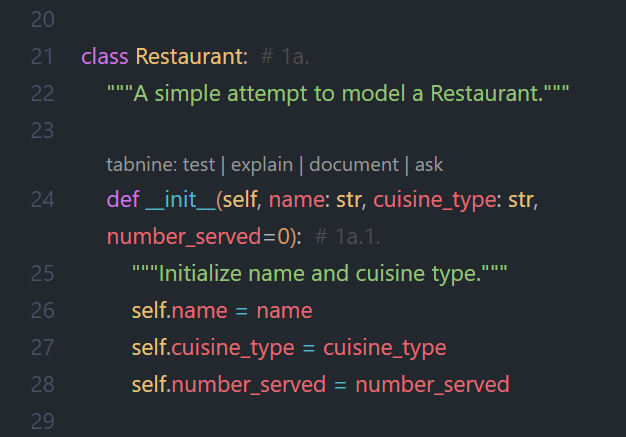

# WHAT I LEARNT

---

## Class & Instantiation

Once one defined several classes, the syntax sinks in and just starts to make sense.  
Being able to nest functions into a class makes sense in regard to my last exercise, the 8-12 one where I wanted to add a function that would increment the number of orders being made for a sandwich shop. Well, a Class for Orders would have been perfect!

---

## Object Methods & Attributes

So with a Class we instantiate objects, which may have functions (and are called methods of that object) and attributes that define that object.  

I was a little confused at first when calling methods, I wrote instead an attribute. This rookie mistake wasn't hard at all to fix but it took me several minutes to understand the error message. 

--- 

## A LIttle Extra

Not much here, just made the parameter `number_served` a default keyword one `number_served=0` (line 24 in exercise_9_4.py):

This way it won't return an error if I forget to pass it in the call. It'll just pass a value of 0 to it.  
And since all restaturants start with 0 clients anyway, it seems more than okay to do it this way. 

I also added an if statement to the instructions #3a. (line 52 of exercise_9_4.py), this way you're prompted if you are entering any integer < 0 (line 58). 

--- 

## How Well Did I do?

After I compared my code to the solutions: 
- **exercise 9-4**:  
  Because of my added if statement mentioned above, I did better than the solution code.  

  GRADE: So it's a high pass.  

- **exercise 9-5**:  
  Here I did almost the exact same code. I just added a couple more testing prints. 

  GRADE: So it's a good pass.  

---

#### Resources:
Python Crash Course 3rd Ed.: [solutions to exercises 9-4 & 9-5](https://ehmatthes.github.io/pcc_3e/solutions/chapter_9/#9-4-number-served)  
